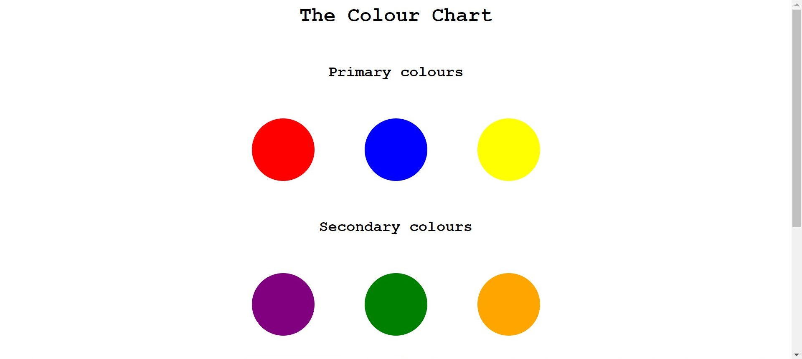

# CodeCell MonthOfMERN Week0

## Task0

### TODO

- [ ] create a heading `The Colour Chart`
- [ ] The chart should have circular elements
  - [ ] Primary Colours
  - [ ] Secondary Colours
- [ ] embed an image as present in your `task0/assets` folder for the colour wheel

## Example Result

